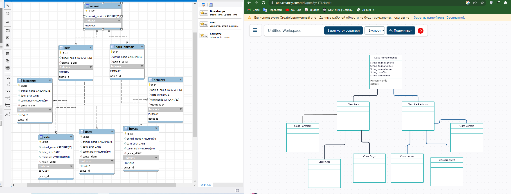
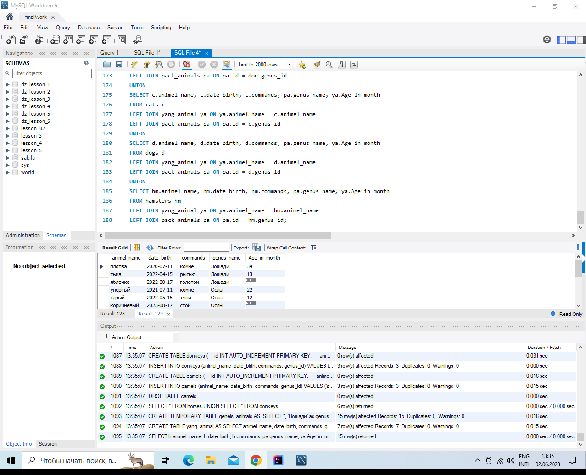

# *Итоговая контрольная работа*

## *Информация о проекте*

Необходимо организовать систему учета для питомника в котором живут
домашние и вьючные животные.

## *task 01:*

Используя команду cat в терминале операционной системы Linux, создать
два файла Домашние животные (заполнив файл собаками, кошками,
хомяками) и Вьючные животными заполнив файл Лошадьми, верблюдами и
ослы), а затем объединить их. Просмотреть содержимое созданного файла.
Переименовать файл, дав ему новое имя (Друзья человека).

mkdir finalControlWork  
cd finalControlWork/  
cat > home_animals.txt  
cat > pack_animals.txt  
cat home_animals.txt  
cat pack_animals.txt  
cat home_animals.txt pack_animals.txt > animals.txt  
cat animals.txt  
mv animals.txt mansFriends.txt  
cat mansFriends.txt


## *task 02:*

Создать директорию, переместить файл туда.

mkdir new_directory  
cd finalControlWork/  
mv mansFriends.txt ../new_directory/  
cd ..  
cd finalControlWork/  
ls -all  
cd ..  
cd new_directory/  
ls -all  


## *task 03:*
Подключить дополнительный репозиторий MySQL. Установить любой пакет
из этого репозитория.

sudo wget https://dev.mysql.com/get/mysql-apt-config_0.8.23-1_all.deb  
sudo dpkg -i mysql-apt-config_0.8.23-1_all.deb  
sudo apt-get update  
sudo apt-get install mysql-server  


## *task 04:*
Установить и удалить deb-пакет с помощью dpkg.

sudo wget https://download.docker.com/linux/ubuntu/dists/jammy/pool/stable/amd64/docker-ce-cli_20.10.13~3-0~ubuntu-jammy_amd64.deb  
sudo dpkg -i docker-ce-cli_20.10.13~3-0~ubuntu-jammy_amd64.deb   
sudo dpkg -r docker-ce-cli


## *task 05:*
Выложить историю команд в терминале ubuntu


## *task 06:*
Нарисовать диаграмму, в которой есть класс родительский класс, домашние
животные и вьючные животные, в составы которых в случае домашних
животных войдут классы: собаки, кошки, хомяки, а в класс вьючные животные
войдут: Лошади, верблюды и ослы).



## *task 07:*
В подключенном MySQL репозитории создать базу данных “Друзья
человека”
```sql
CREATE DATABASE human_friends;
```
## *task 08:*
Создать таблицы с иерархией из диаграммы в БД
```sql
CREATE TABLE animal(
id INT AUTO_INCREMENT NOT NULL PRIMARY KEY,
animal_species VARCHAR(45)
);

INSERT INTO animal (animal_species)
VALUES ('вьючные'),
('домашние');


CREATE TABLE pack_animals
(
id INT AUTO_INCREMENT PRIMARY KEY,
genus_name VARCHAR (20),
animal_id INT,
FOREIGN KEY (animal_id) REFERENCES animal (id) ON DELETE CASCADE ON UPDATE CASCADE
);

INSERT INTO pack_animals (genus_name, animal_id)
VALUES ('Лошади', 1),
('Ослы', 1),  
('Верблюды', 1);


CREATE TABLE pets
(
id INT AUTO_INCREMENT PRIMARY KEY,
genus_name VARCHAR (20),
animal_id INT,
FOREIGN KEY (animal_id) REFERENCES animal (id) ON DELETE CASCADE ON UPDATE CASCADE
);

INSERT INTO pets (genus_name, animal_id)
VALUES ('Кошки', 2),
('Собаки', 2),  
('Хомяки', 2);
```
## *task 09:*
Заполнить низкоуровневые таблицы именами(животных), командами
которые они выполняют и датами рождения
```sql
CREATE TABLE cats 
(       
    id INT AUTO_INCREMENT PRIMARY KEY, 
    animel_name VARCHAR(45),
	date_birth DATE,
    commands VARCHAR(50),
    genus_id int,
    FOREIGN KEY (genus_id) REFERENCES pets (id) ON DELETE CASCADE ON UPDATE CASCADE
);

INSERT INTO cats (animel_name, date_birth, commands, genus_id)
VALUES ('Исида', '2019-12-20', 'кс-кс-кс', 1),
('бася', '2018-10-15', 'нельзя', 1),  
('буся', '2017-11-02', 'брысь', 1);


CREATE TABLE dogs
(       
    id INT AUTO_INCREMENT PRIMARY KEY, 
    animel_name VARCHAR(45),
	date_birth DATE,
    commands VARCHAR(50),
    genus_id int,
    FOREIGN KEY (genus_id) REFERENCES pets (id) ON DELETE CASCADE ON UPDATE CASCADE
);

INSERT INTO dogs (animel_name, date_birth, commands, genus_id)
VALUES ('тося', '2022-09-11', 'сидеть', 2),
('макс', '2002-02-10', 'фу', 2),  
('серый', '2023-01-12', 'рядом', 2);


CREATE TABLE hamsters
(
    id INT AUTO_INCREMENT PRIMARY KEY, 
    animel_name VARCHAR(45),
	date_birth DATE,
    commands VARCHAR(50),
    genus_id int,
    FOREIGN KEY (genus_id) REFERENCES pets (id) ON DELETE CASCADE ON UPDATE CASCADE
);

INSERT INTO hamsters (animel_name, date_birth, commands, genus_id)
VALUES ('белый01', '2021-08-10', 'бежать', 3),
('белый02', '2022-04-15', 'есть', 3),  
('белый03', '2023-02-17', 'спать', 3);


CREATE TABLE horses
(
    id INT AUTO_INCREMENT PRIMARY KEY, 
    animel_name VARCHAR(45),
	date_birth DATE,
    commands VARCHAR(50),
    genus_id int,
    FOREIGN KEY (genus_id) REFERENCES pack_animals (id) ON DELETE CASCADE ON UPDATE CASCADE
);

INSERT INTO horses (animel_name, date_birth, commands, genus_id)
VALUES ('плотва', '2020-07-11', 'комне', 1),
('тьма', '2022-04-15', 'рысью', 1),  
('яблочко', '2022-08-17', 'голопом', 1);


CREATE TABLE donkeys
(
    id INT AUTO_INCREMENT PRIMARY KEY, 
    animel_name VARCHAR(45),
	date_birth DATE,
    commands VARCHAR(50),
    genus_id int,
    FOREIGN KEY (genus_id) REFERENCES pack_animals (id) ON DELETE CASCADE ON UPDATE CASCADE
);

INSERT INTO donkeys (animel_name, date_birth, commands, genus_id)
VALUES ('упертый', '2021-07-11', 'комне', 2),
('серый', '2022-05-15', 'тяни', 2),  
('коричневый', '2023-08-17', 'стой', 2);


CREATE TABLE camels
(
    id INT AUTO_INCREMENT PRIMARY KEY, 
    animel_name VARCHAR(45),
	date_birth DATE,
    commands VARCHAR(50),
    genus_id int,
    FOREIGN KEY (genus_id) REFERENCES pack_animals (id) ON DELETE CASCADE ON UPDATE CASCADE
);

INSERT INTO camels (animel_name, date_birth, commands, genus_id)
VALUES ('двугорбый', '2021-07-11', 'комне', 2),
('одногорбный', '2022-05-15', 'тяни', 2),  
('воспитаный', '2023-08-17', 'стой', 2);

```

## *task 10:*
Удалив из таблицы верблюдов, т.к. верблюдов решили перевезти в другой
питомник на зимовку. Объединить таблицы лошади, и ослы в одну таблицу.

```sql
DROP TABLE camels;
SELECT * FROM horses UNION SELECT * FROM donkeys;
```
## *task 11:*
Создать новую таблицу “молодые животные” в которую попадут все
животные старше 1 года, но младше 3 лет и в отдельном столбце с точностью
до месяца подсчитать возраст животных в новой таблице
```sql
CREATE TEMPORARY TABLE generls_animals AS 
SELECT *, 'Лошади' as genus FROM horses
UNION SELECT *, 'Ослы' AS genus FROM donkeys
UNION SELECT *, 'Собаки' AS genus FROM dogs
UNION SELECT *, 'Кошки' AS genus FROM cats
UNION SELECT *, 'Хомяки' AS genus FROM hamsters;

CREATE TABLE yang_animal AS
SELECT animel_name, date_birth, commands, genus, TIMESTAMPDIFF(MONTH, date_birth, CURDATE()) AS Age_in_month
FROM generls_animals WHERE date_birth BETWEEN ADDDATE(curdate(), INTERVAL -3 YEAR) AND ADDDATE(CURDATE(), INTERVAL -1 YEAR);
 
SELECT * FROM yang_animal;
```

## *task 12:*
Объединить все таблицы в одну, при этом сохраняя поля, указывающие на
прошлую принадлежность к старым таблицам.

```sql
SELECT h.animel_name, h.date_birth, h.commands, pa.genus_name, ya.Age_in_month 
FROM horses h
LEFT JOIN yang_animal ya ON ya.animel_name = h.animel_name
LEFT JOIN pack_animals pa ON pa.id = h.genus_id
UNION 
SELECT don.animel_name, don.date_birth, don.commands, pa.genus_name, ya.Age_in_month 
FROM donkeys don
LEFT JOIN yang_animal ya ON ya.animel_name = don.animel_name
LEFT JOIN pack_animals pa ON pa.id = don.genus_id
UNION 
SELECT c.animel_name, c.date_birth, c.commands, pa.genus_name, ya.Age_in_month 
FROM cats c
LEFT JOIN yang_animal ya ON ya.animel_name = c.animel_name
LEFT JOIN pack_animals pa ON pa.id = c.genus_id
UNION 
SELECT d.animel_name, d.date_birth, d.commands, pa.genus_name, ya.Age_in_month 
FROM dogs d
LEFT JOIN yang_animal ya ON ya.animel_name = d.animel_name
LEFT JOIN pack_animals pa ON pa.id = d.genus_id
UNION 
SELECT hm.animel_name, hm.date_birth, hm.commands, pa.genus_name, ya.Age_in_month 
FROM hamsters hm
LEFT JOIN yang_animal ya ON ya.animel_name = hm.animel_name
LEFT JOIN pack_animals pa ON pa.id = hm.genus_id;
```


