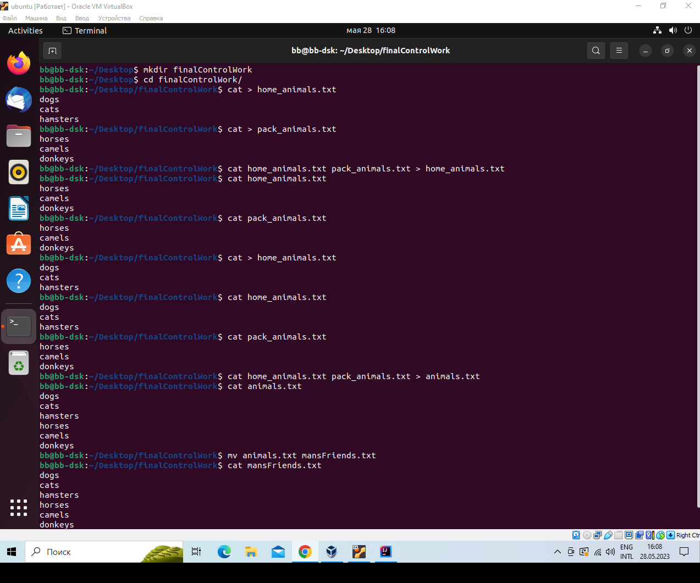
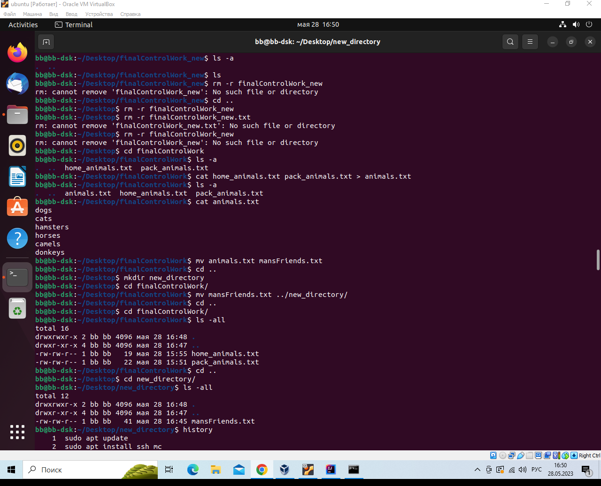
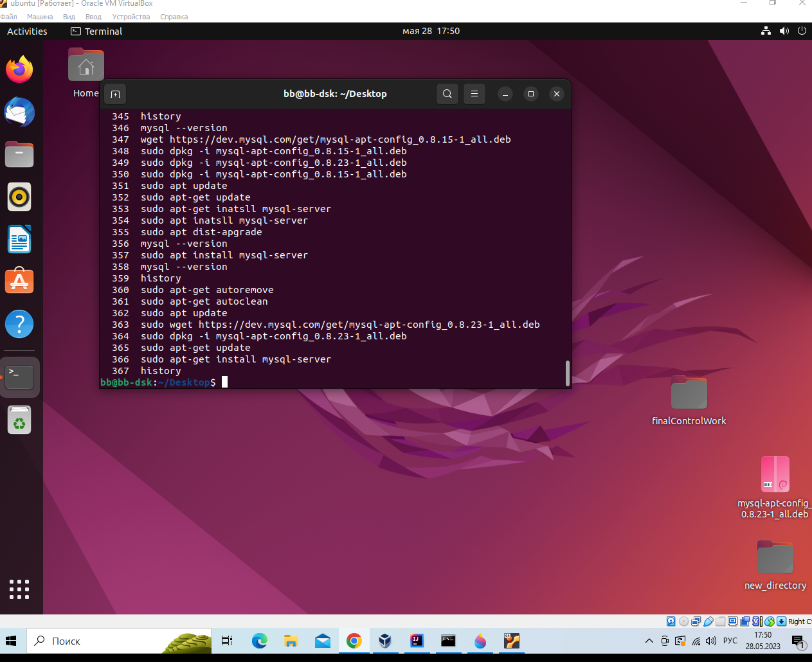
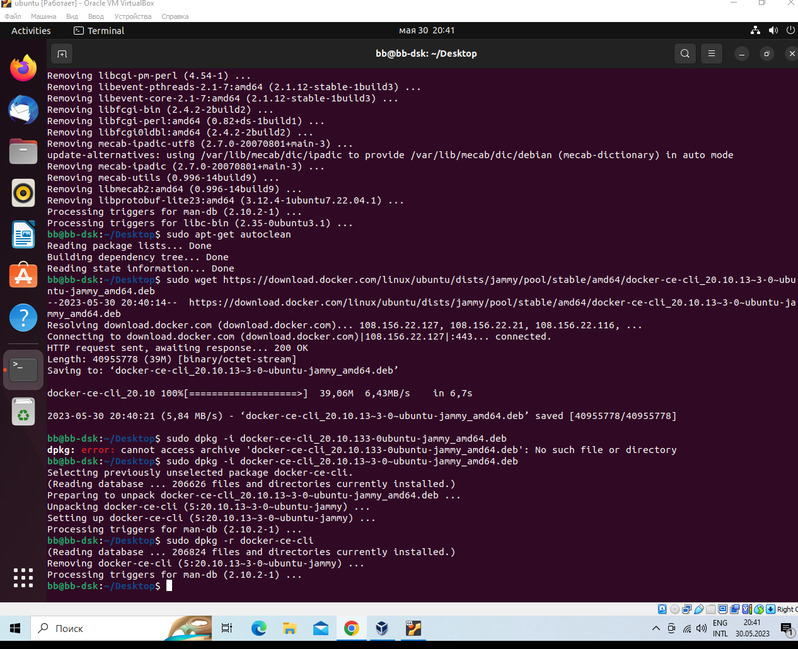
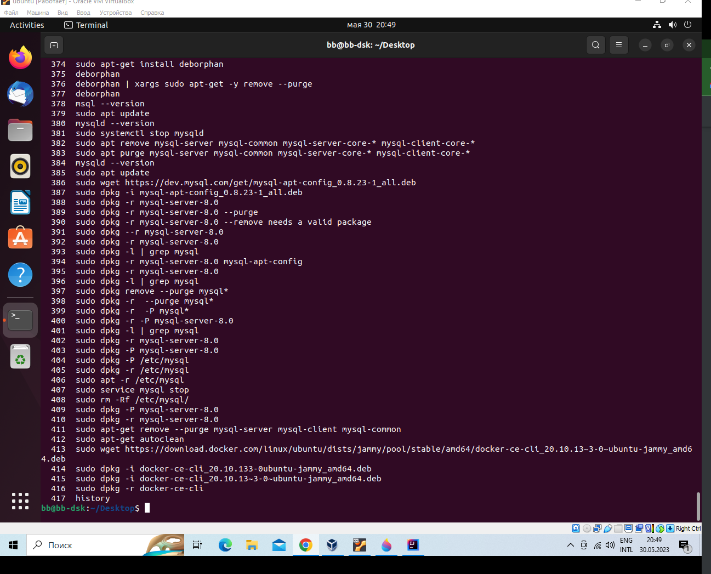

# *Итоговая контрольная работа*

## *Информация о проекте*

Необходимо организовать систему учета для питомника в котором живут
домашние и вьючные животные.

## *task 01:*

Используя команду cat в терминале операционной системы Linux, создать
два файла Домашние животные (заполнив файл собаками, кошками,
хомяками) и Вьючные животными заполнив файл Лошадьми, верблюдами и
ослы), а затем объединить их. Просмотреть содержимое созданного файла.
Переименовать файл, дав ему новое имя (Друзья человека).

mkdir finalControlWork  
cd finalControlWork/  
cat > home_animals.txt  
cat > pack_animals.txt  
cat home_animals.txt  
cat pack_animals.txt  
cat home_animals.txt pack_animals.txt > animals.txt  
cat animals.txt  
mv animals.txt mansFriends.txt  
cat mansFriends.txt

## *task 02:*

Создать директорию, переместить файл туда.

mkdir new_directory  
cd finalControlWork/  
mv mansFriends.txt ../new_directory/  
cd ..  
cd finalControlWork/  
ls -all  
cd ..  
cd new_directory/  
ls -all  

## *task 03:*
Подключить дополнительный репозиторий MySQL. Установить любой пакет
из этого репозитория.

sudo wget https://dev.mysql.com/get/mysql-apt-config_0.8.23-1_all.deb  
sudo dpkg -i mysql-apt-config_0.8.23-1_all.deb  
sudo apt-get update  
sudo apt-get install mysql-server  

## *task 04:*
Установить и удалить deb-пакет с помощью dpkg.

sudo wget https://download.docker.com/linux/ubuntu/dists/jammy/pool/stable/amd64/docker-ce-cli_20.10.13~3-0~ubuntu-jammy_amd64.deb  
sudo dpkg -i docker-ce-cli_20.10.13~3-0~ubuntu-jammy_amd64.deb   
sudo dpkg -r docker-ce-cli

## *task 05:*
Выложить историю команд в терминале ubuntu

